# RAG Service Optimization: Agent-Based Architecture

## 📌 Overview

This document outlines the proposed optimization to migrate from a **monolithic RAG service** to a **multi-agent RAG architecture**, following the latest 2025 industry standards.

---

## 🔄 Current vs. Proposed Architecture

### Current Architecture (Monolithic)


**Limitations:**
- ❌ Rigid regex-based classification
- ❌ Hard to extend with new question types
- ❌ Single processing pipeline (no parallelization)
- ❌ Tightly coupled components
- ❌ Difficult to debug and maintain

---

### Proposed Architecture (Agent-Based)

```mermaid
flowchart TB
    CLIENT[📱 Client] --> ROUTER[🎯 Agent Router / Manager]

    ROUTER --> SA[📝 Summary Agent]
    ROUTER --> KA[🔑 Keyword Agent]
    ROUTER --> CA[⚖️ Comparison Agent]
    ROUTER --> SNA[😊 Sentiment Agent]
    ROUTER --> SEA[🔍 Search Agent]
    ROUTER --> EA[👤 Entity Agent]
    ROUTER --> GA[💬 General Agent]

    SA --> ROUTER
    KA --> ROUTER
    CA --> ROUTER
    SNA --> ROUTER
    SEA --> ROUTER
    EA --> ROUTER
    GA --> ROUTER

    ROUTER --> CLIENT

    TOOLS[🛠️ Shared Tools<br/>━━━━━━━━━<br/>FAISS Vector Search<br/>Claude Generation<br/>Article Fetch]

    style CLIENT fill:#FFB6C1,stroke:#333,stroke-width:3px
    style ROUTER fill:#FFD700,stroke:#333,stroke-width:3px
    style SA fill:#90EE90
    style KA fill:#90EE90
    style CA fill:#90EE90
    style SNA fill:#90EE90
    style SEA fill:#90EE90
    style EA fill:#90EE90
    style GA fill:#90EE90
    style TOOLS fill:#87CEEB
```



**How the Router Works:**

The Agent Router uses **Claude LLM** to intelligently analyze user queries and select the best agent:

1. **Query Analysis**: Router sends the user query to Claude with a specialized routing prompt
2. **Intent Classification**: Claude analyzes the query semantics and identifies the user's intent
3. **Relevance Scoring**: Claude scores each agent's suitability (0.0-1.0) based on:
   - Semantic meaning of the query
   - Required task type (summarize, extract, compare, etc.)
   - Context from conversation history
   - Agent capabilities and specializations
4. **Agent Selection**: Router selects the agent with the highest relevance score
5. **Execution**: Selected agent receives the query and uses shared tools (FAISS, Claude) to generate response
6. **Response Return**: Agent returns result to router, which formats and sends to client

**Example:**
```
Query: "Summarize the AI articles and extract key themes"

Router → Claude Analysis:
  - SummaryAgent score: 0.95 ✓
  - KeywordAgent score: 0.88 ✓
  - ComparisonAgent score: 0.12
  - GeneralAgent score: 0.45

Router decision: Execute both SummaryAgent + KeywordAgent in parallel
Result: Combined summary with key themes
```

**How Specialized Agents Work:**

Each agent is simple and focused on one task:

1. **Receives query** from router with specific instructions
2. **Uses shared tools** to do its job:
   - **FAISS Tool**: Search vector store for relevant article chunks
   - **Claude Tool**: Generate text based on retrieved context
   - **Article Tool**: Fetch additional article content if needed
3. **Applies specialized logic** for its task type (e.g., SummaryAgent formats output as overview + key points)
4. **Returns result** back to router with sources and metadata

**Example - SummaryAgent in action:**
```
1. Router: "Summarize AI articles" → SummaryAgent
2. SummaryAgent → FAISS Tool: Search for AI articles (gets 4 chunks)
3. SummaryAgent → Claude Tool: "Create summary from these chunks"
4. Claude generates structured summary
5. SummaryAgent → Router: Returns summary + source references
6. Router → Client: Formatted response
```

**Benefits:**
- ✅ Dynamic agent selection based on relevance scores
- ✅ Easy to add new specialized agents
- ✅ Parallel agent execution for complex queries
- ✅ Loosely coupled, modular components
- ✅ Clear agent boundaries for debugging
- ✅ Each agent can use different tools and strategies

---

## 🏗️ Implementation Changes

### 1. New Directory Structure

```
rag-service/src/
├── agents/
│   ├── base-agent.ts              # Base class for all agents
│   ├── summary-agent.ts           # "Summarize this article"
│   ├── keyword-agent.ts           # "Extract key topics"
│   ├── comparison-agent.ts        # "Compare article A vs B"
│   ├── sentiment-agent.ts         # "What's the tone?"
│   ├── search-agent.ts            # "Find articles about AI"
│   ├── entity-agent.ts            # "Who is mentioned?"
│   └── general-agent.ts           # General Q&A
│
├── tools/
│   ├── faiss-tool.ts              # FAISS vector search tool
│   ├── claude-tool.ts             # Claude generation tool
│   └── article-fetch-tool.ts     # Article fetching tool
│
├── orchestration/
│   ├── agent-router.ts            # Routes queries to agents
│   └── langgraph-orchestrator.ts # LangGraph workflow (2025)
│
├── services/
│   ├── langchain.service.ts       # Keep for basic RAG operations
│   ├── claude.service.ts          # Keep as-is
│   └── faiss-vectorstore.service.ts # Keep as-is
│
└── routes/
    └── chat.routes.ts              # Update to use orchestrator
```

### 2. Files to Modify

| File | Change | Reason |
|------|--------|--------|
| `services/langchain.service.ts` | Refactor → Base tools | Convert to tool provider |
| `services/prompt-engineering.service.ts` | Replace → Router | Regex classification → Agent scoring |
| `routes/chat.routes.ts` | Update | Call orchestrator instead of LangChain directly |
| `index.ts` | Update | Initialize agent system |

### 3. Files to Create

| File | Purpose |
|------|---------|
| `agents/base-agent.ts` | Abstract base class for all agents |
| `agents/summary-agent.ts` | Specialized agent for summarization |
| `agents/keyword-agent.ts` | Specialized agent for keyword extraction |
| `agents/comparison-agent.ts` | Specialized agent for comparisons |
| `agents/sentiment-agent.ts` | Specialized agent for sentiment analysis |
| `agents/search-agent.ts` | Specialized agent for article search |
| `agents/entity-agent.ts` | Specialized agent for entity extraction |
| `agents/general-agent.ts` | Fallback agent for general queries |
| `tools/faiss-tool.ts` | Tool wrapper for FAISS operations |
| `tools/claude-tool.ts` | Tool wrapper for Claude API |
| `orchestration/agent-router.ts` | Routes queries to best agent |
| `orchestration/langgraph-orchestrator.ts` | LangGraph workflow (optional, for advanced features) |

---

## 🔧 Technology Stack Changes

### Current Stack
```json
{
  "@langchain/anthropic": "^0.3.0",
  "@langchain/community": "^0.3.0",
  "langchain": "^0.3.0"
}
```

### New Dependencies
```json
{
  "@langchain/anthropic": "^0.3.0",
  "@langchain/community": "^0.3.0",
  "@langchain/core": "^0.3.0",
  "@langchain/langgraph": "^0.2.0",    // New: Multi-agent orchestration
  "langchain": "^0.3.0"
}
```

**Install:**
```bash
cd rag-service
npm install @langchain/langgraph @langchain/core
```

---

## 📊 Comparison: Current vs Agent-Based

| Feature | Current | Agent-Based |
|---------|---------|-------------|
| **Classification** | Regex patterns | AI-powered scoring |
| **Extensibility** | Add regex + prompt | Add new agent class |
| **Maintainability** | Tightly coupled | Loosely coupled |
| **Debugging** | Hard to trace | Clear agent boundaries |
| **Parallelization** | Sequential only | Multiple agents in parallel |
| **Tool Access** | Hardcoded | Agents select tools dynamically |
| **Specialization** | Generic prompts | Specialized agent logic |
| **Fallback** | Single error path | Agent-specific error handling |

---

## 🚀 Implementation Phases

### Phase 1: Foundation (Week 1)
- [ ] Install LangGraph
- [ ] Create base agent class
- [ ] Implement agent router with scoring
- [ ] Create FAISS and Claude tools

### Phase 2: Agent Migration (Week 2)
- [ ] Create `SummaryAgent` (replaces `summary` type)
- [ ] Create `KeywordAgent` (replaces `keywords` type)
- [ ] Create `ComparisonAgent` (replaces `comparison` type)
- [ ] Create `SentimentAgent` (replaces `sentiment` type)
- [ ] Test each agent independently

### Phase 3: Integration (Week 3)
- [ ] Update `chat.routes.ts` to use orchestrator
- [ ] Implement router scoring logic
- [ ] Add fallback to `GeneralAgent`
- [ ] Update error handling

### Phase 4: Advanced Features (Optional)
- [ ] Parallel agent execution (complex queries)
- [ ] Agent chaining (one agent calls another)
- [ ] Agent memory (remember past interactions)
- [ ] Self-improvement (learn from feedback)

---

## 💡 Example: Agent Execution Flow

### Query: "Summarize the AI articles and extract keywords"

**Current Approach:**
1. Classify as "summary" (first match)
2. Generate summary
3. Ignore "extract keywords" request ❌

**Agent-Based Approach:**
1. Router scores:
   - `SummaryAgent`: 0.92 ✓
   - `KeywordAgent`: 0.89 ✓
   - Others: < 0.5
2. Execute **both** agents in parallel
3. Combine results:
   ```json
   {
     "summary": "...",
     "keywords": ["AI", "machine learning", "GPT"],
     "sources": [...]
   }
   ```
4. Return comprehensive response ✅

---

## 📚 Research & References (2025)

This optimization follows the latest industry research:

1. **[MA-RAG: Multi-Agent RAG via Collaborative Reasoning](https://arxiv.org/abs/2505.20096)** (2025)
   - Planner, Step Definer, Extractor, QA Agents architecture

2. **[CIIR@LiveRAG 2025: Multi-Agent RAG Optimization](https://arxiv.org/html/2506.10844)** (SIGIR 2025)
   - Specialized agents for planning, searching, reasoning, coordination

3. **[Talk to Right Specialists: Routing in Multi-agent Systems](https://arxiv.org/html/2501.07813v1)** (2025)
   - Router with knowledge boundaries and intelligent agent selection

4. **[Anthropic's Multi-Agent Research System](https://www.anthropic.com/engineering/multi-agent-research-system)** (2025)
   - Production-ready multi-agent architecture

5. **[LangGraph: Multi-Agent Workflows](https://blog.langchain.com/langgraph-multi-agent-workflows/)** (LangChain Blog)
   - Official LangChain multi-agent orchestration framework

6. **[Building Multi AI Agent Workflows With LangChain](https://www.intuz.com/blog/building-multi-ai-agent-workflows-with-langchain)** (2025)
   - Practical implementation guide

7. **[Enhancing RAG with Multi-Agent System](https://superlinked.com/vectorhub/articles/enhancing-rag-multi-agent-system)** (VectorHub)
   - Benefits and architecture patterns

---

## 🎓 Interview Talking Points

### 1. **Problem Statement**
"Our current RAG service uses regex-based classification, which is rigid and hard to extend. Adding a new question type requires modifying the prompt engineering service and testing all existing patterns."

### 2. **Proposed Solution**
"We'll implement an agent-based architecture where each specialized agent handles specific tasks. An agent router calculates relevance scores and routes queries to the best agent(s)."

### 3. **Technology Choice**
"We'll use LangGraph, which is the 2025 standard for multi-agent orchestration in the LangChain ecosystem. It provides sophisticated state management and parallel execution."

### 4. **Concrete Example**
"If a user asks 'Summarize AI articles and extract keywords,' the router can run both SummaryAgent and KeywordAgent in parallel, then combine their results - something our current system can't do."

### 5. **Benefits**
- **Modularity**: Each agent is independent and testable
- **Extensibility**: Add new agents without touching existing code
- **Performance**: Parallel execution for complex queries
- **Maintainability**: Clear boundaries and responsibilities
- **Debugging**: Easy to trace which agent handled what

### 6. **Implementation Complexity**
"The migration is straightforward - we're essentially converting our existing 8 question types into 8 specialized agents, each with access to shared tools (FAISS, Claude). The router replaces our regex classification."

### 7. **Backward Compatibility**
"The Go backend doesn't need any changes. The API contract remains the same - we still accept queries and return responses with sources. The improvements are internal to the RAG service."

---

## ⚡ Quick Start (After Implementation)

```bash
# Install new dependencies
cd rag-service
npm install @langchain/langgraph

# Run with agent-based architecture
npm run dev

# Test specific agent
curl -X POST http://localhost:3001/api/chat \
  -H "Content-Type: application/json" \
  -d '{
    "query": "Summarize the article about AI",
    "conversationId": "test-123"
  }'

# Response will include agent metadata
{
  "response": "...",
  "sources": [...],
  "metadata": {
    "selectedAgent": "SummaryAgent",
    "agentScore": 0.95,
    "toolsUsed": ["faiss_search", "claude_generate"]
  }
}
```

---

## 🔮 Future Enhancements

Once the agent architecture is in place:

1. **Dynamic Agent Loading**: Load agents from plugins at runtime
2. **Agent Learning**: Improve routing based on user feedback
3. **Custom User Agents**: Users can create their own specialized agents
4. **Agent Marketplace**: Share and download community agents
5. **Cross-Agent Communication**: Agents collaborate on complex tasks
6. **Agent Monitoring**: Dashboard showing agent performance metrics

---

## 📝 Notes

- This optimization is **backward compatible** - Go backend requires no changes
- Can be implemented **incrementally** - migrate one agent at a time
- Uses **industry-standard** frameworks (LangChain, LangGraph)
- Based on **latest 2025 research** in multi-agent RAG systems
- Maintains current **performance characteristics** while enabling future optimizations

---

## 🤝 Contributing

When implementing this optimization:

1. Start with one agent (e.g., `SummaryAgent`)
2. Test thoroughly before migrating others
3. Keep existing code until all agents are working
4. Update documentation as you go
5. Add monitoring for agent performance

---

**Last Updated:** 2025-01-03
**Status:** Proposed Optimization
**Estimated Effort:** 3-4 weeks
**Risk Level:** Low (backward compatible, incremental migration)
