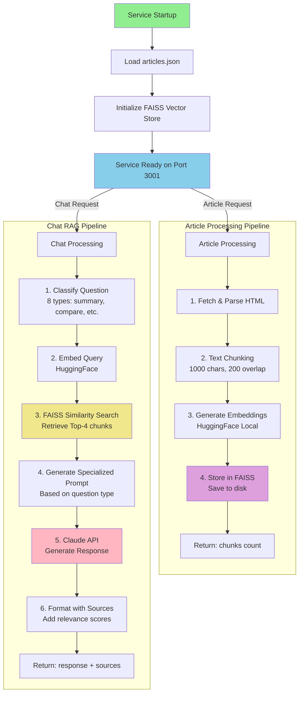

# Node.js RAG Service

This service handles all AI and RAG operations for Article Chat. It processes articles, generates embeddings, stores them in a vector database, and uses Claude AI to answer questions about your articles with intelligent intent detection.

## What it does

- Fetches and processes articles from URLs
- Generates embeddings using local HuggingFace models
- Stores vectors in FAISS for similarity search
- Integrates with Claude AI for intelligent responses
- **Dynamic Article Retrieval**: Retrieves articles from vector store, runtime processing, and file system
- **Intelligent Intent Detection**: Uses LangChain chains to analyze user prompts and determine how to respond
- **LangChain Integration**: All user prompts go through LangChain decision-making process while preserving conversation history
- Manages conversation context and memory

## RAG Process Flow



**Key Components:**
- **LangChain**: Orchestrates RAG pipeline (TextSplitter, FAISS, ChatAnthropic)
- **FAISS**: Local vector storage with HuggingFace embeddings (no API costs)
- **Claude**: claude-3-7-sonnet-latest for response generation
- **Question Classification**: 8 specialized prompt types for better responses

## Requirements

- Node.js 20 or higher
- npm or yarn
- Anthropic API key

## Setup

1. Copy the environment file:

```bash
cd rag-service
cp .env.example .env
```

2. Edit `.env` and add your Anthropic API key:

```
ANTHROPIC_API_KEY=sk-ant-api03-your-key-here
```

3. Install dependencies:

```bash
npm install
```

## Running locally

For development with hot reload:

```bash
npm run dev
```

Alternative development mode (without hot reload):

```bash
npm run start:dev
```

For production mode:

```bash
npm run build
npm start
```

The service will start on http://localhost:3001

## Available endpoints

- `GET /health` - Health check
- `POST /api/chat` - Chat with articles using intelligent intent detection
- `POST /api/chat/stream` - Streaming chat responses
- `POST /api/articles/process` - Process a new article
- `GET /api/articles/list` - List all available articles (dynamic retrieval)

## Recent Improvements

### Enhanced RAG Workflow

- **LangChain Chain Integration**: Implements LangChain chains to analyze user prompts and determine appropriate response actions
- **Smart Article Retrieval**: Dynamically retrieves articles from multiple sources (vector store, runtime processing, file system)
- **Intelligent Question Classification**: LangChain-based intent detection handles various question phrasings
- **Decision-Making Process**: All user prompts processed through LangChain decision-making while maintaining conversation context

## Key environment variables

- `ANTHROPIC_API_KEY` - Your Claude API key (required)
- `CLAUDE_MODEL` - Claude model to use (default: claude-3-7-sonnet-latest)
- `PORT` - Service port (default: 3001)
