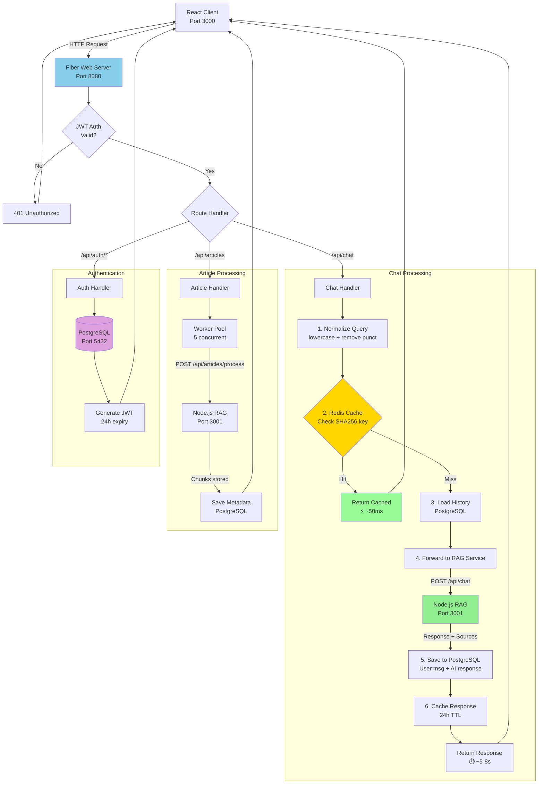

# Go API Gateway

This service acts as the API gateway for the Article Chat system. It handles HTTP requests from the frontend, manages user authentication with PostgreSQL, caches responses with Redis, and forwards requests to the RAG service.

## What it does

- Routes API requests between frontend and backend services
- **User Authentication**: Secure signup, login, and session management with PostgreSQL
- **Conversation History**: Persistent chat storage and retrieval
- Caches responses in Redis for fast repeated queries
- Handles concurrent requests with worker pools
- Provides health check endpoints

## API Gateway Flow



**Key Responsibilities:**

1. **Redis Cache** (Port 6379)
   - Smart caching with text normalization (SHA256 keys)
   - 24-hour TTL
   - 99.4% faster for repeated queries (~50ms vs ~5-8s)
   - Fallback to memory cache if Redis unavailable

2. **PostgreSQL** (Port 5432)
   - User authentication (bcrypt password hashing)
   - Conversation history persistence
   - Message storage (user + assistant)
   - Article metadata tracking

3. **To Node.js RAG Service** (Port 3001)
   - `POST /api/chat`: `{query, conversationId, history}`
   - `POST /api/articles/process`: `{url, title, metadata}`
   - Retry logic: 3 attempts with exponential backoff

4. **To React Client** (Port 3000)
   - `{response, sources, conversationId, tokensUsed, cached, processingTime}`
   - Sources include article chunks with relevance scores
   - Error codes: 401 (auth), 400 (validation), 503 (service down)

## Requirements

- Go 1.24 or higher
- PostgreSQL 15+ (for authentication and data storage)
- Redis (optional, will use memory cache if not available)

## Setup

1. Copy the environment file:

```bash
cd server
cp .env.example .env
```

2. Install dependencies:

```bash
go mod tidy
go mod download
```

## Running locally

```bash
go run cmd/api/main.go
```

The server will start on http://localhost:8080

**Note**: Make sure the RAG service is running on port 3001 for full functionality.

## Available endpoints

### System

- `GET /api/health` - Health check

### Authentication

- `POST /api/auth/signup` - User registration
- `POST /api/auth/login` - User login
- `GET /api/auth/me` - Get current user profile
- `POST /api/auth/logout` - Logout current session

### Chat & Conversations

- `POST /api/chat` - Send chat messages (requires auth)
- `GET /api/conversations` - List user conversations (requires auth)
- `POST /api/conversations` - Create new conversation (requires auth)

### Articles

- `POST /api/articles` - Add new articles (requires auth)
- `GET /api/articles` - List articles (requires auth)
